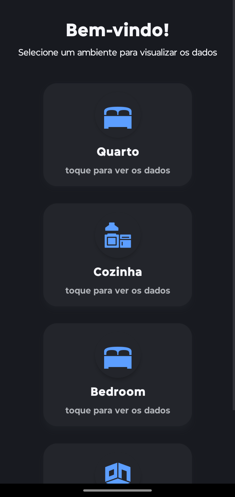
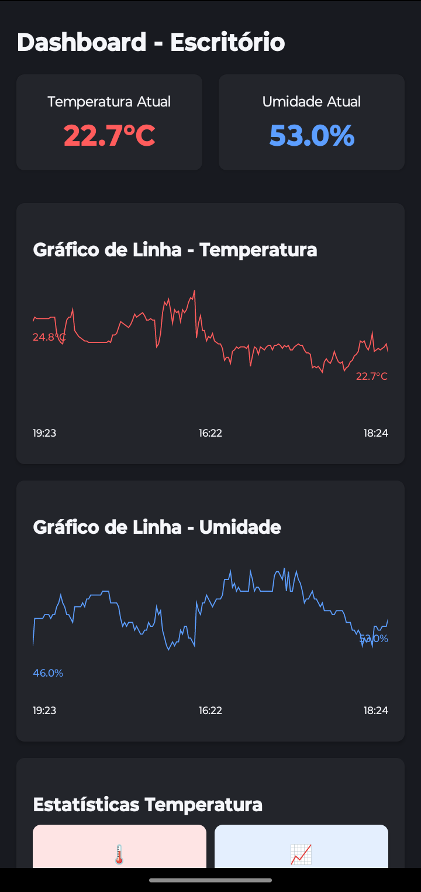

# App de Monitoramento de Sensores (Frontend Mobile)

Este repositório contém o código do **frontend mobile** do projeto. O aplicativo é desenvolvido em React Native e se conecta a uma API de backend para exibir e analisar dados de temperatura e umidade.

 | 

## Funcionalidades Implementadas

-   **Autenticação de Usuário:** Telas de Login e Cadastro para gerenciamento de acesso.
-   **Dashboard:** Visualização de dados formatados.
-   **Análise Estatística:**
    -   Cálculo de Média, Mediana, Moda, Máximo, Mínimo, Desvio Padrão, Assimetria e Curtose.
    -   Análise de percentuais (ex: % do tempo acima de 30°C, % de umidade fora do ideal).
    -   Cálculo de probabilidades.
    -   Previsão de dados futuros utilizando Regressão Linear.
-   **Visualização de Dados:**
    -   Gráfico de Linha para Temperatura e Umidade vs. Tempo.
    -   Histograma e Boxplot para distribuição dos dados.
-   **Tema Escuro:** Interface com paleta de cores noturnas para melhor conforto visual.

## Tecnologias Utilizadas

-   **Core:** [React Native](https://reactnative.dev/), [TypeScript](https://www.typescriptlang.org/)
-   **Navegação:** [React Navigation](https://reactnavigation.org/)
-   **Requisições HTTP:** [Axios](https://axios-http.com/)
-   **Gráficos e Visualizações:**
    -   [react-native-svg](https://github.com/react-native-svg/react-native-svg)
    -   [react-native-svg-charts](https://github.com/JesperLekland/react-native-svg-charts)
-   **Cálculos Estatísticos:**
    -   [math.js](https://mathjs.org/)
    -   [simple-statistics](https://simplestatistics.org/)
-   **Manipulação de Datas e Horas:** [Moment.js](https://momentjs.com/)

## Pré-requisitos

-   [Node.js](https://nodejs.org/en/) (versão LTS recomendada)
-   [Yarn](https://classic.yarnpkg.com/en/docs/install) ou [npm](https://www.npmjs.com/get-npm)
-   [React Native CLI](https://reactnative.dev/docs/environment-setup)
-   [Android Studio](https://developer.android.com/studio) (para Android) / [Xcode](https://developer.apple.com/xcode/) (para iOS)
-   **A API de backend do projeto deve estar em execução e acessível.**

## Instalação e Configuração

1.  **Clone o repositório do frontend:**
    ```bash
    git clone [URL]
    ```

2.  **Acesse o diretório do projeto:**
    ```bash
    cd appMobile
    ```

3.  **Instale as dependências:**
    ```bash
    npm install
    # ou
    yarn install
    ```

## Executando o Aplicativo

1.  **Certifique-se de que o servidor backend esteja rodando.**

2.  **Execute em um dispositivo ou emulador:**

    -   **Para Android:**
        ```bash
        npm run android
        ```

    -   **Para iOS:**
        ```bash
        npm run ios
        ```
